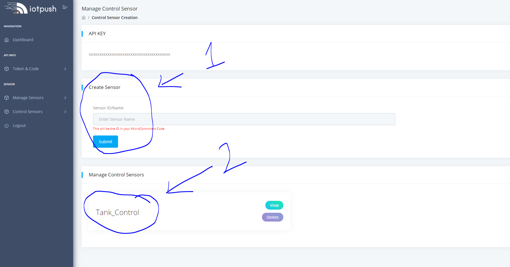
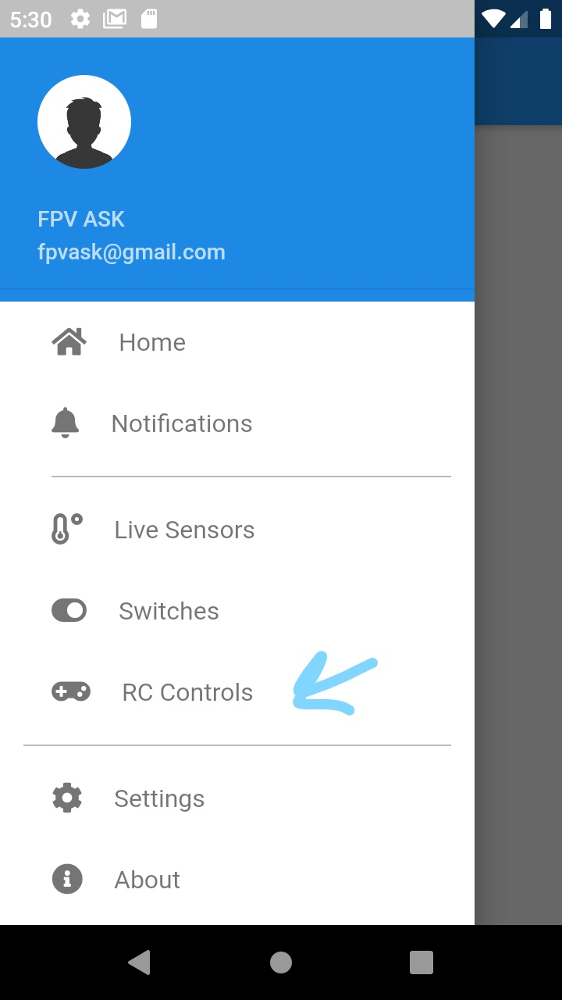
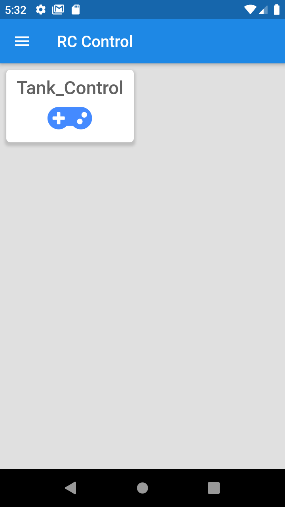
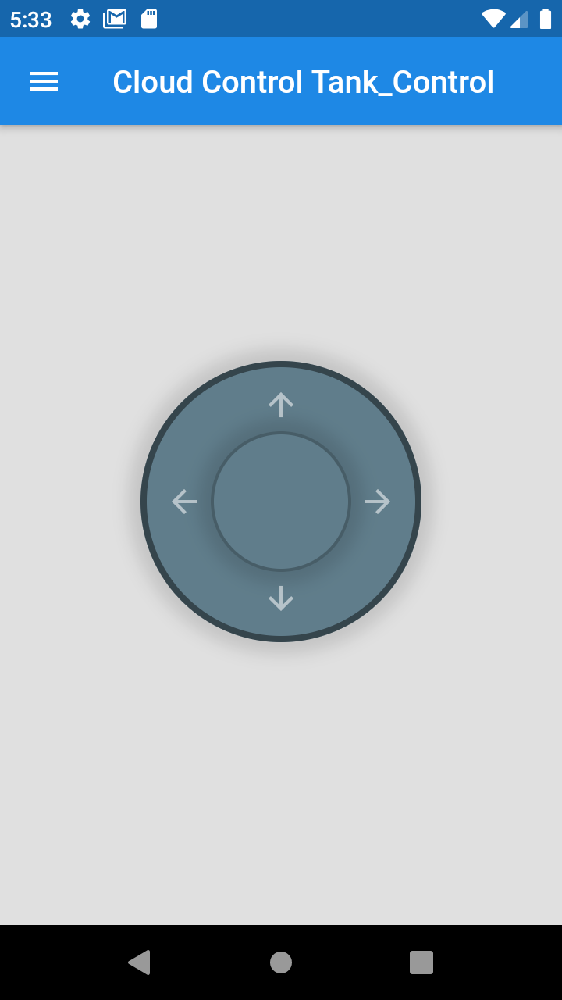

# ESP8266 Tank Project V1 // Cloud Control 

# Parts List
1. [Tank](http://bit.ly/3dT0ghK)
2. [ESP8266](http://bit.ly/3rdAgS0)
3. [Motor Driver](http://bit.ly/2ZY0zQs)
4. [2s Battery](http://bit.ly/3r2qfau)
5. [Batery Connector](http://bit.ly/3uDMR3m)

# Grab Your Token
1. [Here is how to get your token](https://github.com/DroneMesh/IOTPUSH)

# Create Control ID
1. [Create Control Here](https://iotpush.app/create-sensor-control)
2. Save it somewhere for now make sure to replace space with underscore

# Now you should see it in the app

# Now We will install the code on the ESP8266

[VIDEO WILL BE OUT SOON ON THE CHANNEL](http://youtube.com/dronemesh)