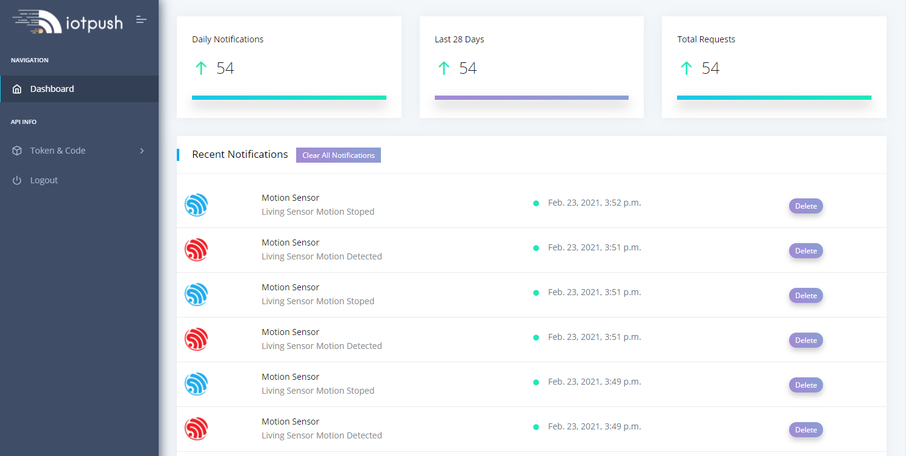
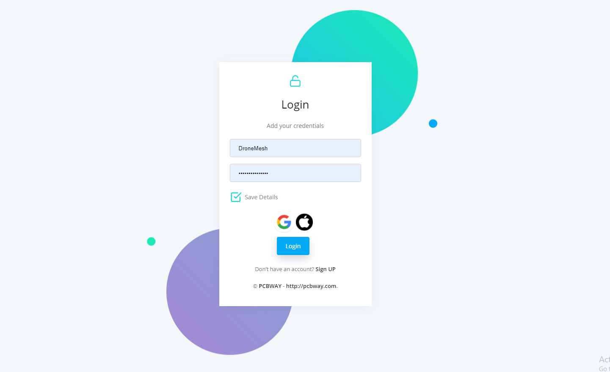
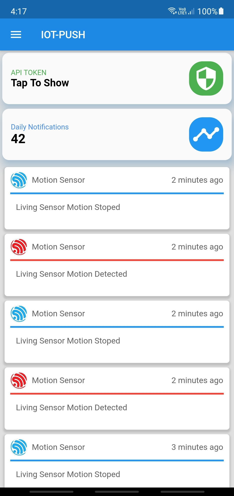
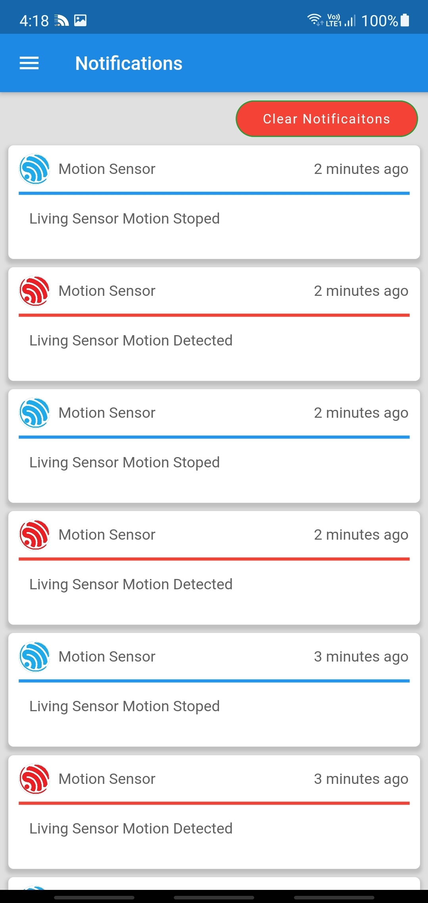
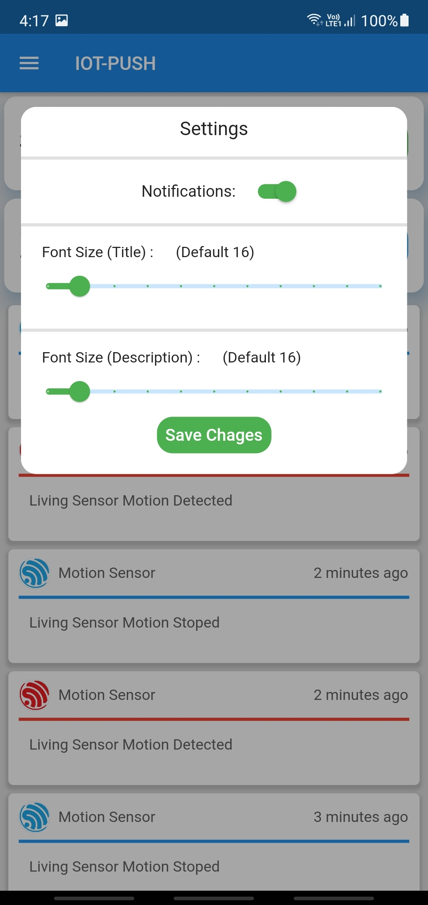
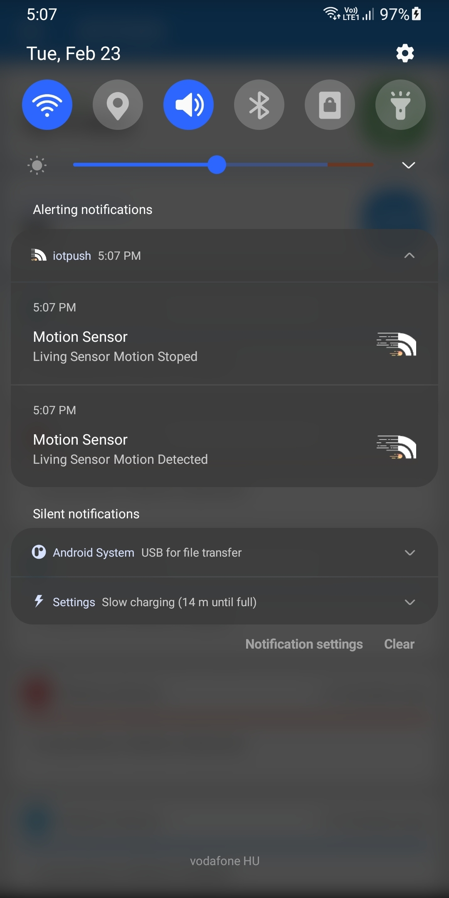
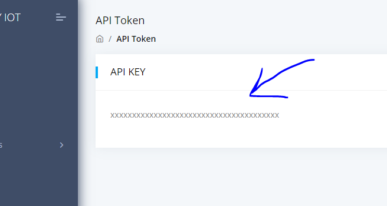

# IOT PUSH Documentation
## ESP32 & ESP8266 ---> Android or IOS
### All Code Examples Are Available
This System is designed to send push notifications to your IOS and or Android Device. It also saves all your notifications to view whenever you would like. You can view your notifications from either the web panel and or your phone.
1. [Android APP LINK] Waiting Playstore Reivew
2. [IOS APP LINK] Waiting Apple Store Reivew
3. [WEB Admin Panel LINK](https://iotpush.app)

Everything is sent over SSL Protocol.
# Screenshots Web Panel
<p float="left">


</p>

# Screenshots IOS & ANDROID
<p float="left">




</p>


## Getting Started

1. Create an account through the [Android_APP]() , [IOS_APP]() or the [WebPanel](https://iotpush.app)
2. If you would like to receive the notifiations on your phone you must have the app installed and be logged in to your account

# Grab Your Token
### You can get your token from the Web Panel or Phone App

### Android & IOS Token will be available on Home Screen


### Web Admin Panel
Admin Panel Token will be located [HERE](https://iotpush.app/get-token)




# How To Send The Notification ESP32 
1. Example Code [HERE](https://github.com/DroneMesh/IOTPUSH/tree/master/Examples)


# SENDING NOTIFICATIONS IS EASY

### In the ESP32_Arduino_Example file everything is described in plain english for everyone.
You will need to modify a couple lines.


## Add Your Token Here
```
char token[] = "a8d4cffa289b8979f51f02936acbed49595f26";

```

# Static Request
### Static Request Is Great For Sensors that dont relay back dynamic or changing data such as a Motion Sensor or Door Sensor
```
// ------  Static Request -------
// Title of Notification EX: Motion Sensor
char title[] = "Motion Sensor";

// Description of Notification EX: Motion Detected In Living Room
char desc[] = "Motion Detected In Living Room";

// Color of Notification: red, purple, yellow, green, blue, pink, orange
// If no color specified it will default to red
char color[] = "pink";

// Gourping Notifications in phone notification bar
// Leave it Defualt Unless you know what you are doing
char group[] = "1";

// Send Phone Push Notification Alert 
// If false it will still write the notification in the app and webapp but you will not receive notification
// If true it will notify your phone with a push notification
// "true" or "false"
/* IMPORTANT THIS MUST BE SPELLED CORRECTLY  */
/* true or false  */
char notify[] = "true";
// ------  END Static Request -------
```
## Send Static The Notification
### You will want to call this function below when for example the motion detector has been trigered and it will send the static notification you have setup above

```
sendStatic();
```

# Dynamic Request
### Dynamic Request is great if you are using something like a temprature sensor where the data is changing. To call this function it's very simple and done in one line of code
```
// sendCustom("TITLE","INFORMATION","COLOR","SEND_ALERT_TO_PHONE");
sendCustom("Temp Sensor #1","Current Temprature -5c","blue","true");
```
1. TITLE = 'Title Of Notification'
2. INFORMATION = 'THE SENSORS DATA YOU WANT SENT TO YOU'
3. COLOR = 'Colors of notification check the list below for available Colors'
4. SEND_ALERT_TO_PHONE = 'If you want your phone to get the notification alert set to true else false'


# AVAILBLE COLORS
## [red, blue, green, pink, purple, yellow, orange]
