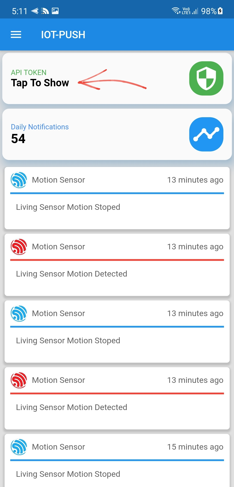

# ***  IMPORTANT NOTE ***
## Please use the same login method on Web Panel & Application or your account will freeze and you must contact me to fix it.
Email:  admin@iotpush.app

Subject: Account Frozen

body: Your Email Address
# IOT PUSH Documentation
## ESP32 & ESP8266 ---> Android or IOS
### All Code Examples Are Available
This System is designed to send push notifications and enable you to control any wifi enabled micro controller such as an ESP8266, ESP32 or Raspberry Pi through your IOS and or Android Device. 
1. [Android APP LINK](https://play.google.com/store/apps/details?id=com.iot.esp) ON THE PLAYSTORE
2. [IOS APP LINK](https://apps.apple.com/us/app/iotpush/id1555250298) ON THE APP STORE
3. [WEB Admin Panel LINK](https://iotpush.app)

Everything is sent over SSL Protocol.
# Screenshots Web Panel

# Screenshots IOS & ANDROID

## Video Tutorial

## Getting Started

1. Create an account through the [Android_APP](https://github.com/DroneMesh/IOTPUSH) , [IOS_APP](https://github.com/DroneMesh/IOTPUSH) or the [WebPanel](https://iotpush.app)
2. If you would like to receive the notifiations on your phone you must have the app installed and be logged in to your account

# Grab Your Token
### You can get your token from the Web Panel or Phone App

### Android & IOS Token will be available on Home Screen

### Web Admin Panel
Admin Panel Token will be located [HERE](https://iotpush.app/get-token)

# How To Send The Notification ESP32 & ESP8266
## [Sending Notification Code and Documentaion Found HERE](https://github.com/DroneMesh/IOTPUSH/tree/master/Notification_Eaxmples)

